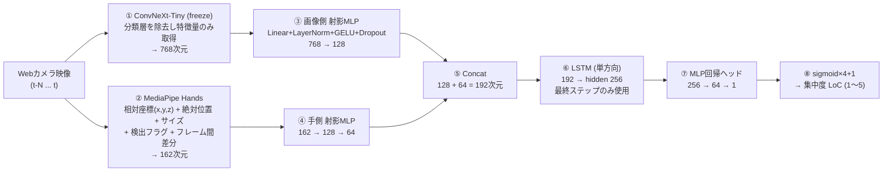
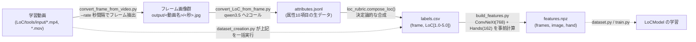

# Online Study Room

オンライン自習室サービスのための研究開発リポジトリ。現時点での中核コンポーネントは、**Webカメラ映像から学習者の集中度（LoC: Level of Concentration）を1〜5の5段階で推定するマルチモーダル回帰モデル**（`LoC/` ディレクトリ）です。

> **リポジトリの現状について**
> このリポジトリは実装が進行中のプロトタイプです。`LoC/` 配下の各モジュール（ConvNeXt / MediaPipe Hands / LSTM / MLP）は **`LoC/core.py` の `LoCModel` として1本のパイプラインに結線済み** で、特徴キャッシュ（`tools/build_features.py`）→ 学習（`train.py`）→ 推論（`infer.py`）まで通ります。ただし実データでの学習・評価は未実施です。詳細は [現在の実装状況と既知のギャップ](#現在の実装状況と既知のギャップ) を参照してください。

## 目次

- [プロジェクト概要](#プロジェクト概要)
- [リポジトリ構成](#リポジトリ構成)
- [LoC集中度推定モデル：アーキテクチャ](#loc集中度推定モデルアーキテクチャ)
- [データ作成パイプライン](#データ作成パイプライン)
- [セットアップ](#セットアップ)
- [使い方](#使い方)
- [テスト](#テスト)
- [現在の実装状況と既知のギャップ](#現在の実装状況と既知のギャップ)
- [技術選定メモ](#技術選定メモ)

## プロジェクト概要

Online Study Room は、オンライン自習室（作業用ライブ配信/共同学習ルーム）上で、参加者の学習映像から**集中度を自動でスコアリングする**ことを目指すプロジェクトです。

- リポジトリ直下の `main.py` と `System/` は、将来的にアプリケーション本体（自習室サービス側）を実装するためのプレースホルダーで、現時点では未実装（空）です。
- 実質的な開発は `LoC/`（Level of Concentration の略）ディレクトリに集約されており、次の2本柱で構成されています。
  1. **モデルアーキテクチャの実装**（ConvNeXt-Tiny + MediaPipe Hands + LSTM + MLP による集中度回帰モデル）
  2. **学習データ作成パイプライン**（学習動画 → フレーム分割 → VLM（Ollama / qwen3.5）による集中度の自動ラベリング）

## リポジトリ構成

```
Online_Study_Room/
├── main.py                        # (未実装/空) アプリケーション エントリーポイント
├── System/                        # (未実装/空) 自習室サービス本体を実装予定のディレクトリ
├── .gitignore
└── LoC/                            # 集中度(LoC)推定モデルの開発一式
    ├── core.py                     # **LoCModel**（①〜⑧を結線したモデル本体）
    ├── dataset.py                  # features.npz + labels.csv → 時系列窓データセット（分割方式・ラベル平滑化）
    ├── train.py                    # 学習スクリプト（Huber損失 / LoC=-1 のマスク / 動画単位分割）
    ├── evaluate.py                 # leave-one-video-out 交差検証で汎化性能を測る
    ├── infer.py                    # 学習済みモデルによるリアルタイム推論（Webカメラ/動画）
    ├── MediaPipe_Hands.sample.py   # MediaPipe Hands によるWebカメラ手検出デモ
    ├── README.md                   # (簡易版) フレーム抽出スクリプトの使い方メモ
    ├── requirements.txt            # 依存パッケージ（現状 opencv-python のみ）
    │
    ├── ConvNeXT/                   # 画像特徴抽出（意味ベクトル）
    │   ├── image_feature_extractor.py # **ImageFeatureExtractor**（分類ヘッドなし・768次元特徴）
    │   ├── tiny_model.py           # ConvNeXt-Tiny で画像から生ロジットを取得するCLI
    │   ├── finetune.py             # HuggingFace Trainer によるファインチューニング雛形
    │   └── output/logits.npy       # tiny_model.py 実行結果のサンプル出力
    │
    ├── MediaPipe_Hands/            # 手指運動特徴抽出
    │   └── hand_feature_extractor.py # HandFeatureExtractor / extract_hand_features（162次元特徴ベクトル抽出）
    │
    ├── LSTM/                       # 時系列特徴抽出
    │   ├── LSTM.py                 # SimpleLSTM（サイン波予測によるPoC）
    │   └── LSTM_train.py           # 上記の学習ループサンプル
    │
    ├── MLP/                        # 回帰/分類ヘッド
    │   ├── projection.py           # **ProjectionMLP**（Linear+LayerNorm+GELU の射影ブロック ③④）
    │   ├── MLP_classifier.py       # 2層MLP（PoC、2値分類設定）
    │   └── MLP_classifier_train.py # 上記の学習ループサンプル
    │
    ├── tools/                      # データ作成パイプライン
    │   ├── convert_frame_from_video.py  # 動画 → 秒間隔でのフレーム画像切り出し
    │   ├── convert_LoC_from_frame.py    # フレーム群 → LoCラベルCSV生成（Ollama/qwen3.5使用）
    │   ├── dataset_creation.py          # 上記2つを1コマンドで実行する統合パイプライン
    │   ├── qwen3_5.py                    # Ollama経由でqwen3.5にLoCを判定させるプロンプト＋呼び出し
    │   ├── input/                        # (gitignore) 元動画の置き場
    │   └── output/                       # (gitignore) 抽出フレーム & labels.csv の出力先
    │
    └── tests/
        ├── test_dataset_creation.py       # dataset_creation のユニットテスト
        ├── test_core_model.py             # LoCModel の結線・出力レンジのユニットテスト
        ├── test_loc_dataset.py            # LoCSequenceDataset の窓切り出し／ラベル除外のテスト
        └── test_hand_feature_extractor.py # HandFeatureExtractor のユニットテスト
```

## LoC集中度推定モデル：アーキテクチャ

設計上のゴールは、直近の連続フレーム（Webカメラ映像）から、現在の集中度を **1〜5の回帰値** として出力するモデルです。画像の「意味情報（何をしているか）」と「手の運動情報（ペンを動かしている/スマホを触っているなど）」を別々に抽出し、**それぞれを射影MLPで低次元に圧縮してから** concat、時系列方向にLSTMで統合したうえでMLPヘッドにより回帰します。

> この設計は `LoC/core.py` の `LoCModel` として実装済みです。①②（特徴抽出）は学習前に `tools/build_features.py` でキャッシュする前提のため、`LoCModel.forward` が受け取るのは生画像ではなく **特徴ベクトルの時系列** `(B, T, 768)` / `(B, T, 162)` です。リアルタイムに生フレームから推定する経路は `LoC/infer.py` の `LoCPredictor` が担います。



| # | コンポーネント | 役割 | 次元 | 対応する実装 | 状態 |
|---|---|---|---|---|---|
| ① | ConvNeXt-Tiny | 画像の意味ベクトルを抽出（分類ヘッドを外し特徴抽出器として使用。初期はfreezeし特徴を事前キャッシュ） | →768 | `LoC/ConvNeXT/image_feature_extractor.py`（`ImageFeatureExtractor`）, `LoC/tools/build_features.py` | **実装済み**。`ConvNextModel` を freeze してロードし `pooler_output` の768次元を返す。特徴キャッシュも実装済み（`tiny_model.py` / `finetune.py` は従来の分類PoCとして残存） |
| ② | MediaPipe Hands | 手指21関節点から姿勢・位置・運動特徴を抽出 | →162 | `LoC/MediaPipe_Hands/hand_feature_extractor.py`（`HandFeatureExtractor` / `encode_hand_block` / `compute_velocity`） | **実装済み**。片手81次元×両手。レイアウトは下表を参照 |
| ③ | 画像側 射影MLP | 768次元をLoCタスク向けの空間へ適応させ、②との次元不均衡を是正 | 768→128 | `LoC/MLP/projection.py`（`ProjectionMLP`）, `LoC/core.py` | **実装済み**。Linear+LayerNorm+GELU+Dropout(0.2) |
| ④ | 手側 射影MLP | 手指座標の非線形な関係（指の開き具合・相対配置）を抽象化 | 162→64 | `LoC/MLP/projection.py`, `LoC/core.py` | **実装済み**。162→128→64 の2ブロック |
| ⑤ | Concat | ③④を結合 | 128+64=192 | `LoC/core.py` | **実装済み** |
| ⑥ | LSTM | 時系列特徴の集約。**単方向**・最終タイムステップのみ使用 | 192→256 | `LoC/LSTM/LSTM.py`（`SimpleLSTM`）, `LoC/core.py` | **実装済み**。`SimpleLSTM(input_size=192, hidden_size=256, output_size=64)` として流用（`fc` が⑦の前半を兼ねる）。`LSTM_train.py` のサイン波PoCは `make_sine_dataset()` として併存 |
| ⑦ | MLP回帰ヘッド | 隠れ状態をスカラーへ変換 | 256→64→1 | `LoC/core.py`（`SimpleLSTM.fc` + `LoCModel.head`） | **実装済み**。256→64 はLSTM側の全結合、64→1 が `head`。`MLP_classifier.py` は分類PoCとして別途残存 |
| ⑧ | 出力レンジ制約 | `sigmoid(x)*4+1` で出力を物理的に1〜5へ収める | 1 | `LoC/core.py`（`LOC_MIN` / `LOC_MAX`） | **実装済み**（`tests/test_core_model.py` で値域を検証） |

**②手指特徴（162次元）の内訳** — 片手あたり81次元のブロックを Left / Right の順に並べます。

| オフセット | 次元 | 名称 | 内容 |
|---|---|---|---|
| `[0:60]` | 60 | `rel` | landmark 1〜20 の手首基準の相対座標 (x, y, z)。手のサイズで正規化し、アスペクト比を補正済み。landmark 0 は定義上つねに原点なので含めない |
| `[60:62]` | 2 | `wrist_xy` | 手首(landmark 0)の絶対位置 (x, y)。正規化画像座標 |
| `[62:63]` | 1 | `scale` | 手のサイズ（手首→中指付け根の距離）。カメラからの距離の代理量 |
| `[63:64]` | 1 | `flag` | 検出フラグ（検出=1.0 / 未検出=0.0） |
| `[64:66]` | 2 | `wrist_vel` | 手首の絶対位置のフレーム間差分。手全体の移動量 |
| `[66:81]` | 15 | `tip_vel` | 指先5点の相対座標のフレーム間差分。指の動き |

想定する `forward` の骨子:

```python
class LoCModel(nn.Module):
    def __init__(self, img_dim=768, hand_dim=162, d_img=128, d_hand=64, hidden=256):
        super().__init__()
        self.img_proj = nn.Sequential(
            nn.Linear(img_dim, d_img), nn.LayerNorm(d_img), nn.GELU(), nn.Dropout(0.2)
        )
        self.hand_proj = nn.Sequential(
            nn.Linear(hand_dim, 128), nn.LayerNorm(128), nn.GELU(),
            nn.Linear(128, d_hand), nn.LayerNorm(d_hand), nn.GELU(),
        )
        self.lstm = nn.LSTM(d_img + d_hand, hidden, num_layers=1, batch_first=True)
        self.head = nn.Sequential(nn.Linear(hidden, 64), nn.GELU(), nn.Linear(64, 1))

    def forward(self, img_feat, hand_feat):     # (B, T, 768), (B, T, 162)
        z = torch.cat([self.img_proj(img_feat), self.hand_proj(hand_feat)], dim=-1)
        out, _ = self.lstm(z)
        return torch.sigmoid(self.head(out[:, -1, :])) * 4 + 1   # → [1, 5]
```

`LoC/core.py` の `LoCModel` が上記をそのまま実装しています（学習対象は射影MLP + LSTM + ヘッドの約60万パラメータ）。`SimpleLSTM` は「LSTM → 最終ステップ → 全結合」という実装なので、`output_size=64` で生成することで⑥と⑦前半をまとめて担わせ、`LoCModel.head`（GELU + `Linear(64, 1)`）が⑦後半、`torch.sigmoid(...) * 4 + 1` が⑧に対応します。

### 設計上の意思決定

**各枝の直後に射影MLPを置く（③④）**

- **次元不均衡の是正**: 素の特徴量をそのままconcatすると `768 : 162 ≒ 5 : 1` となり、手の運動特徴が入力の2割弱しか占めません。「ペンを動かしている / スマホを触っている」を捉えるためにMediaPipe Handsを入れたにもかかわらず、その信号が画像特徴に埋もれてしまいます。`768→128` / `162→64` へ射影すれば `2 : 1` となり、両モダリティが対等に寄与します。
- **ドメイン適応**: ConvNeXt-Tinyの768次元はImageNet 1000クラス識別のための特徴空間です。ConvNeXtをfreezeして使う前提では、これを「集中度」という軸へ射影し直す層がないと、その役割までLSTMが背負うことになります。
- **副次効果**: LSTMの入力次元が930→192に下がるため、LSTM本体のパラメータも約122万→約46万に削減されます。

**画像入力の直後にはMLPを置かない**

224×224×3 = 150,528次元の生ピクセルに全結合層を掛けると、隠れ層512でも約7,700万パラメータとなり、ConvNeXt-Tiny本体（約2,800万）を大きく上回ります。加えて全結合は画素の空間的近接性を破壊するため、後段のConvNeXtが前提とする局所構造が失われます。入力側で行うべきなのはMLPではなく**前処理**（リサイズ・正規化・データ拡張・顔領域クロップ）です。パッチ埋め込み的な線形変換はConvNeXtのstemが既に担っています。

**手特徴（②）は射影MLPより先に特徴設計を改善する（実施済み）**

当初の84次元（21点×(x,y)×両手の生座標）には、MLPを何層重ねても回復できない情報欠落がありました。射影MLPを載せる前にこれを解消し、162次元へ再設計しています。

1. **検出フラグの追加**（効果が最も大きい）— 手が未検出のとき0埋めしていたため、「両手が画面左上端にある」状態と数値上ほぼ区別できませんでした。左右それぞれに `flag` 次元を持たせ、0埋めブロックを明示的に識別できるようにしています。
2. **z座標の利用** — MediaPipeは21点×**(x, y, z)** を返しますが、以前はx, yのみ使用していました。奥行きは「机に手を置いている / 顔を触っている」の判別に効きます。
3. **手首基準の相対座標化** — 絶対座標のままではカメラ位置や座り方に依存します。手首（landmark 0）を原点とし、手首→中指付け根の距離で正規化することで、平行移動とカメラ距離の両方に不変な形状表現になっています（`tests/test_hand_feature_extractor.py` で不変性を検証）。一方「手が画面のどこにあるか」自体も集中度の手がかりなので、手首の絶対位置 `wrist_xy` と手のサイズ `scale` を別次元として残しています。
4. **フレーム間差分（速度）** — 「動かしている」の本質は差分です。LSTMでも学習可能ですが、明示的に与えた方が少データで収束します。手全体の移動（`wrist_vel`）と指の動き（`tip_vel`）を分離しているため、「手ごと動かしている」と「手は置いたまま指だけ動かしている（筆記・タイピング）」を区別できます。

実装上の注意点が2つあります。

- **速度計算はステートフル** — `HandFeatureExtractor` は直前フレームの状態を保持します。別の動画に移る際は `reset()` を呼ばないと、動画の境界をまたいだ差分が混入します。
- **未検出フレームとの差分は取らない** — 未検出ブロックは0ベクトルなので、そのまま差分を取ると手が現れた瞬間に巨大な偽の速度が立ちます。両フレームで検出されている場合のみ差分を計算し、それ以外は0としています。

なお、アスペクト比の補正も入れています。MediaPipeのxは画像の幅で、yは高さで正規化されるため、非正方形の映像では手の形が歪んで表現されます。相対座標の算出時にxとz（zはxとほぼ同じスケールと定義されている）へ幅/高さを掛け、等方な空間に揃えたうえで正規化しています。これにより解像度やアスペクト比の異なるカメラ間で特徴が一貫します。

**出力レンジと損失関数**

`sigmoid(x)*4+1` により出力を物理的に1〜5へ収めます。損失はMSEではなく **Huber（`SmoothL1Loss`）** を使います。ラベルがVLM（qwen3.5）による自動生成でノイズを含むため、外れ値に引っ張られにくい方が安全です。なお `qwen3_5.py` は判定不能時に `-1` を返す仕様のため、**該当行を学習から除外するマスク処理が必須**です。

**LSTMは単方向のまま**

`LSTM.py` の `out[:, -1, :]` を使う設計（最終タイムステップのみ利用）は妥当です。リアルタイム推論では未来フレームを参照できないため、bidirectional化してはいけません。

### 学習の進め方

学習データはVLMによる自動ラベルであり、`--rate 5`（5秒間隔）なら1時間の動画から約720フレームしか得られません。この規模で「ConvNeXt全体のファインチューニング + 各所にMLP」は容量過多で、過学習が避けられません。次の順序を推奨します。

1. **ConvNeXtをfreeze**し、全フレームの768次元特徴を事前に `.npy` へキャッシュする。学習が数十倍高速になり、過学習も抑えられる。
2. 射影MLP + LSTM + 回帰ヘッド（合計100万パラメータ弱）のみを学習する。
3. 精度が頭打ちになった段階で初めて、ConvNeXtの最終ステージだけを低学習率で解凍する。

### 将来の拡張候補

現アーキテクチャには顔・視線・頭部姿勢の明示的な特徴がありません。一般論としては「画面や教材を見ているか / よそ見しているか / 突っ伏しているか」の方が手の動きより支配的な手がかりで、MediaPipe Face Mesh / Pose の追加が有力な選択肢になります。

**ただし現在の学習データではこれが使えません。** 収集済みの動画はすべて**机の真上から手元を写した画角**で、顔・上半身・視線はフレームに入っていません。写っているのは手・ペン・ノート・教材・机上の物体だけです。Face Mesh / Pose を足しても検出対象が存在しないため、この路線を採るなら**先にカメラの画角を変える（または顔用のカメラを足す）**必要があります。

この画角の制約は、ラベリング側にも影響します。現在のプロンプト（`tools/qwen3_5.py`）は「机に突っ伏している」「頬杖など姿勢が崩壊」「視線が対象から外れる」を判定基準に含めていますが、いずれも**写っていないものを判定させている**ため、ラベルノイズの一因になっていると考えられます。

## データ作成パイプライン

上記モデルを学習するための教師データを作るパイプラインが `LoC/tools/` にあります。人手でのラベリングの代わりに、ローカルで動くVLM（Ollama経由のqwen3.5）に判定させる方式です。

### 集中度を直接聞かず、観測可能な属性を経由する

初期版は「集中度を1〜5で答えて」とVLMに総合判断を丸投げしていました。これは次の理由で失敗していました。

- ラベルの76%が3と4に集中し、3/4/5の区別が機能していなかった
- 隣接フレーム（入力の95%が共通）で45%もラベルが変わり、**分散の約6割が独立ノイズ**だった（`lag-1` 自己相関 0.37）
- 判定基準の多く（突っ伏し・頬杖・視線）が、**そもそも画角に写っていない**ものだった

学習動画はすべて机の真上〜斜め上から撮った手元ショットで、顔は入っても部分的、視線は判定できません。写っていないものを判定させれば幻覚が返るだけです。

そこで、質問を「観測可能な事実」に分解し、集中度はその事実から**決定論的な式**で合成する方式に変えました。

```
フレーム --qwen(2コール)--> 属性10項目 --compose_loc()--> LoC (1.0〜5.0)
                              ↓
                    attributes.jsonl（一次データ）
                              ↓
                    labels.csv（派生物。再生成できる）
```

この分解には3つの利点があります。

1. **合成ルールを変えても再推論が要らない**。`--recompose` で `attributes.jsonl` から `labels.csv` を作り直せます。LoCは派生値にすぎません。
2. **属性ごとに検証できる**。人手のゴールド集合と突き合わせれば、どの判定が壊れているか特定できます。総合値1〜5では原因を切り分けられません。
3. **モデルの補助タスクに使える**。属性を同時に予測させると、少データでの正則化として効きます。



### 属性スキーマ

すべての属性は **`not_visible`** を取れます。画角によって写らないものがあるためで、合成式は観測できた証拠だけで正規化するので、画角が違ってもLoCのスケールが揃います。

| 属性 | 値 | 役割 |
|---|---|---|
| `hands_in_frame` | 0 / 1 / 2 | 離席の検出 |
| `phone` | absent / on_desk / in_hand | 最も強い非学習シグナル |
| `pen_held` | true / false | 筆記の準備状態 |
| `pen_tip_on_paper` | true / false | 筆記そのもの |
| `hand_on_material` | true / false | 読書・思考中の関与 |
| `writing_increased` | true / false | **学習が進んだ唯一の直接証拠**（60秒前との比較） |
| `page_turned` | true / false | 学習の進行 |
| `material_open` | true / false | 学習セッションの成立 |
| `device_in_use` | none / pc / tablet | 筆記以外の学習形態の救済 |
| `head_posture` | upright / propped / down | 上半身が写るときのみ |

視線（`gaze`）は入れていません。現在の画角では判定できないためで、正面画角のデータが入った段階で追加します。

### LoCの合成ルール（`loc_rubric.py`）

まず**ゲート**（非学習が確定する条件）を見て、当たればそこで値を決め打ちます。

| 条件 | LoC |
|---|---|
| スマホを手に持っている | 1.0 |
| 机に突っ伏している | 1.0 |
| 手が写らず、ペンも教材にも触れていない（離席） | 1.5 |
| 教材が開いておらず、デバイスも使っていない | 2.0 |

ゲートに当たらなければ、3.0 を基準に証拠で加減点します。項目は3種類に分かれます。

- **CORE**（不在が意味を持つ。正規化の分母に入る）: `writing_increased` +0.8 / `pen_tip_on_paper` +0.5 / `pen_held` +0.2 / `hand_on_material` +0.2 / `head_posture=upright` +0.3
- **BONUS**（在れば加点、無くても減点にならない）: `device_in_use` +0.4 / `page_turned` +0.2 / 両手 +0.1
- **NEGATIVE**: 止まっている −0.6 / `phone=on_desk` −0.5 / `head_posture=propped` −0.4

PC・タブレットで学習しているときは紙のCOREを分母から外します。外さないと「PCだからペンを持っていない」が減点として働いてしまうためです。BONUSを分母に入れないのは、「ページをめくっていない」が非集中の証拠ではないからです。

### なぜqwenに2回聞くのか

属性10項目を1回のプロンプトでまとめて聞くと、**`writing_increased` が8フレーム中8回ともfalse**になりました（目視では明らかに書き込みが増えている）。一方、2枚の画像だけを見せて「書き込みは増えたか」だけを聞くと正しくtrueを返し、根拠も具体的に述べます。能力の問題ではなく、他の9項目に埋もれていたということです。

そこで質問を性質ごとに分けています。

1. **進捗コール**: 60秒前と現在の2枚を見せ、時間方向の変化だけを聞く（`writing_increased` / `page_turned`）
2. **状態コール**: 現在の1枚だけを見せ、その瞬間の静的な事実を聞く（残り8項目）

さらに、進捗コールは「**既定は false。はっきり確認できる場合のみ true**」と明示しています。素直に聞くと96%がtrueになり、人が離席していて2枚が実質同一のフレームでもtrueを返すためです。聞き方を4通り比較した結果、この形が最も正確でした（正解の分かる6ペアで 5/6。素直に聞く形は 3/6）。VLMは「違いを探せ」と言われると違いを作ってしまうので、判断を保留したときに倒れる先をfalse側に固定しておく必要があります。

### 各スクリプト

- **`convert_frame_from_video.py`**: 動画（または動画の入ったディレクトリ）を受け取り、`--rate` 秒ごとに1フレームを `output/<動画ファイル名>/<秒数>.jpg` として書き出します（OpenCV使用）。
- **`loc_rubric.py`**: 属性スキーマ（`ATTRIBUTE_SPEC`）、モデル出力の正規化（`normalize_attributes`）、LoCの合成（`compose_loc`）。Ollamaに依存しないので単体でテストできます。`SCHEMA_VERSION` を `attributes.jsonl` に記録しており、属性を足し引きしたらこれを上げます。
- **`qwen3_5.py`**: Ollama の `qwen3.5:9b`（既定）へ進捗コールと状態コールを投げ、属性の辞書を返す `evaluate_attributes()` を提供します。`samples > 1` で同じ入力を複数回サンプリングし、**属性ごとに多数決**を取ります（割れた属性は `not_visible` になるので、自信のない判定が教師に混ざりません）。
- **`convert_LoC_from_frame.py`**: フレームディレクトリを走査して属性を判定し、`attributes.jsonl` と `labels.csv` を書き出します。`--stride N` でNフレームおきに評価して間を線形補間（コストが 1/N になります）、`--recompose` で再推論なしに `labels.csv` だけ作り直し、`--simulate` でOllamaなしの動作確認ができます。1件ごとに追記するので、中断しても同じコマンドで再開できます。
- **`dataset_creation.py`**: 上記を1コマンドに統合したパイプライン。`--reuse-frames` を付けると抽出済みフレームを再利用するので、ラベルだけ付け直したいときに数時間かかる再抽出を避けられます。
- **`build_features.py`**: 抽出済みフレームを ConvNeXt-Tiny（768次元）と MediaPipe Hands（162次元）に通し、`output/<動画名>/features.npz` として保存します。ConvNeXtをfreezeして使うため、学習前に1度だけ通せば足ります。`dataset.py` はこの `features.npz` と `labels.csv` を突き合わせて時系列窓を作ります。

## セットアップ

```bash
# Python 仮想環境の作成（例）
cd LoC
python -m venv .venv
.venv\Scripts\activate   # PowerShell / Windows

pip install -r requirements.txt
```

> **注意**: `requirements.txt` にはモデル本体（`torch`, `transformers`）・データ作成（`opencv-python`, `mediapipe`）・ラベリング（`ollama`）・テスト（`pytest`）を含めてあります。加えて以下が必要です。
>
> | 用途 | 追加で必要なもの |
> |---|---|
> | 集中度ラベリング (`tools/qwen3_5.py`) | ローカルで [Ollama](https://ollama.com/) を起動し `qwen3.5` モデルをpull済みであること |
> | ConvNeXtのファインチューニング (`ConvNeXT/finetune.py`) | `torchvision`, `datasets`, `evaluate`, `pandas`, `scikit-learn`, `matplotlib`, `seaborn` |
> | GPU学習 | CUDA対応の `torch`（`train.py` は `cuda` が使えれば自動で使う） |
>
> **Pythonバージョンに注意**: `mediapipe` は Python 3.12 以前向けの配布しかないため、`torch` と `mediapipe` を同一環境に入れるには 3.11 系の仮想環境を使うこと。

## 使い方

### 動画からフレームを抽出する

```bash
python LoC/tools/convert_frame_from_video.py <動画ファイル or ディレクトリ> --output output --rate 1
```

- `--rate`: サンプリング間隔（秒）。既定 `1`。
- 出力は `output/<動画ファイル名>/<秒数>.jpg`。

### フレーム群から集中度ラベル(labels.csv)を生成する

```bash
# Ollama + qwen3.5 が必要。10秒おきに評価し、間は線形補間する
python LoC/tools/convert_LoC_from_frame.py output/<動画ファイル名> --stride 2

# 合成ルールを変えたとき: 再推論せず attributes.jsonl から labels.csv を作り直す
python LoC/tools/convert_LoC_from_frame.py output/<動画ファイル名> --recompose

# Ollamaなしで動作確認だけしたい場合
python LoC/tools/convert_LoC_from_frame.py output/<動画ファイル名> --simulate
```

- `--stride N`: Nフレームおきに評価し、間を線形補間します。集中度は本来なめらかに変化するので、5秒刻みで全フレームを個別に判定するのは冗長です。推論コストが 1/N になります。
- `--samples N`: 同じ入力をN回サンプリングして属性ごとに多数決を取ります。割れた属性は `not_visible` になります。コストはN倍です。
- 1件ごとに `attributes.jsonl` へ追記するので、**中断しても同じコマンドで再開**できます。

### 動画 → フレーム抽出 → ラベリングを一括実行

```bash
python LoC/tools/dataset_creation.py <動画ファイル or ディレクトリ> --output output --rate 5 --stride 2

# 抽出済みフレームを再利用して、ラベルだけ付け直す
python LoC/tools/dataset_creation.py tools/input --output tools/output --rate 5 --stride 2 --reuse-frames
```

### フレーム群から学習用の特徴量をキャッシュする

```bash
# output/<動画名>/ のフレームを ConvNeXt(768次元) + MediaPipe Hands(162次元) に通し、
# 同じディレクトリへ features.npz を書き出す
python LoC/tools/build_features.py output --batch-size 16
```

ConvNeXtはfreezeして使うため、ここで1度通しておけば学習中に画像を読み直す必要がありません。手の速度特徴は直前フレームとの差分なので、動画ディレクトリごとに `HandFeatureExtractor.reset()` を挟んで処理します。

### 集中度回帰モデルを学習する

```bash
python LoC/train.py output --split video --label-smooth 5 --seq-len 20 --epochs 50
```

- `--seq-len`: LSTMに入れる時系列長（直近何フレームを見るか）。
- `--split`: 学習/検証の分け方。
  - `video`（既定）: **動画単位**で振り分ける。同一動画は片側にしか入らないので、人物・部屋・服装・カメラ位置が train と val で共有されない。ConvNeXtの768次元はImageNet特徴で背景や人物を強くエンコードしているため、同一動画が両側に入ると「誰のどの部屋か」を手がかりに当てられてしまう。**汎化性能を測るならこちら**。
  - `tail`: 動画ごとに時系列順で末尾 `--val-ratio` を検証に回す（旧挙動）。同一動画が両側に入るためリークがあり、数字は楽観的に出る。学習が回っているかの確認用。
- `--val-videos`: 検証に回す動画ディレクトリ名をカンマ区切りで明示する（`--split video` のとき）。
- `--label-smooth`: ラベル系列にかける中央値フィルタの幅（奇数。1で無効、**推奨5**）。qwenのラベルは窓を1フレームずつずらして独立に生成されるため、隣接フレームが入力の95%を共有しているのに45%のフレームでラベルが変わり、分散の約6割が独立ノイズになっています。中央値フィルタは「実際に集中が切れた瞬間」のステップを保ったままスパイクだけを削ります。平滑化後のラベルは整数でなくなりますが、回帰タスクなのでそのまま教師に使えます。
- `--val-ratio`: 検証に回す割合（既定0.2）。`--split video` では動画単位で切るため目標値として扱われます。どちらの分割でもランダムシャッフルはしません（連続フレームはほぼ同一内容なので、シャッフルするとリークが最大化されます）。
- 損失は `SmoothL1Loss`（Huber）。`labels.csv` の `LoC = -1`（qwen3.5が判定不能）の行は教師から除外されます。
- 毎エポック、**「常に学習データのラベル平均を出力するだけ」の予測器のMAE**（`baseline_MAE`）を併記します。`val_MAE` がこれを下回っていなければ、モデルは入力を使えていないのと同じです。
- ベストスコアのチェックポイントを `LoC/checkpoints/loc_model.pt` に保存します。

### 汎化性能を交差検証で測る

```bash
python LoC/evaluate.py output --label-smooth 5 --epochs 20
```

全動画を1本ずつ検証側へ回して学習し（leave-one-video-out）、`val_MAE` の加重平均を出します。検証に回す動画を1組に固定すると、どの動画が当たったかで数字が大きく動く（1本あたり39〜788サンプルとばらついている）ため、当たり外れを均すために使います。動画14本・20エポックでCPUでも約4分です。

ラベルの品質はモデルより先に効きます。現状のラベルは分散の約6割が独立ノイズで、`lag-1` 自己相関は0.37しかありません。この水準では、完璧なモデルでも MAE 0.52 程度が下限になります。ラベリング方式を変える際は、人手で付けたゴールド集合（数百フレーム）との一致を基準に比較してください。

### 学習済みモデルで集中度を推定する

```bash
# Webカメラ
python LoC/infer.py --source 0 --interval 5
# 動画ファイル（ウィンドウ表示なし）
python LoC/infer.py --source video.mp4 --no-display
```

`--interval` は**学習データ作成時の `--rate` に合わせる**こと。手の速度特徴はフレーム間隔に依存するため、間隔が変わると特徴のスケールが変わります。

### ConvNeXt-Tiny で画像の768次元特徴を取得する

```bash
python LoC/ConvNeXT/image_feature_extractor.py <画像パス> --output feature.npy
```

### ConvNeXt-Tiny で画像の生ロジットを取得する

```bash
python LoC/ConvNeXT/tiny_model.py <画像パス> --output LoC/ConvNeXT/output/logits.npy
```

### MediaPipe Hands のWebカメラデモ

```bash
python LoC/MediaPipe_Hands.sample.py
# `q` / `Esc` で終了
```

### MediaPipe Hands で画像から162次元特徴ベクトルを取得する

```bash
python LoC/MediaPipe_Hands/hand_feature_extractor.py <画像パス> --output features.npy
```

単一画像では速度成分は0になります。コードから連続フレームを処理する場合:

```python
from MediaPipe_Hands.hand_feature_extractor import HandFeatureExtractor

with HandFeatureExtractor() as extractor:
    for frame_bgr in frames:                     # 同一動画のフレームを時系列順に
        features = extractor.extract(frame_bgr)  # shape: (162,)
    extractor.reset()   # 別の動画に移る前に直前フレームの状態を破棄する
```

`HandFeatureExtractor` は速度特徴のために直前フレームの状態を保持するステートフルなオブジェクトです。動画をまたぐ際に `reset()` を呼ばないと、境界をまたいだ差分が速度成分に混入します。

## テスト

```bash
cd LoC
pytest
```

現状のテストは以下の5ファイル・計53件です（`torch` が無い環境では `test_core_model.py` / `test_loc_dataset.py` はスキップされます）。

- `tests/test_dataset_creation.py` — `dataset_creation.build_pipeline_config` の設定値組み立てを検証。
- `tests/test_core_model.py` — `LoCModel` の出力形状、値域が必ず1〜5に収まること、③〜⑦の次元がアーキテクチャ表と一致すること、単方向であること、最終タイムステップのみを使うこと、両ブランチに勾配が流れることを検証。
- `tests/test_loc_dataset.py` — 時系列窓の切り出し（過去側に取る／動画をまたがない／先頭のウォームアップを捨てる）、`LoC = -1` と未ラベル行の除外、`tail` 分割が時系列順であること、`video` 分割で同一動画がtrain/valの両側に入らないこと、中央値フィルタがスパイクを消しステップと端点を保つこと（`-1` を平滑化に巻き込まないこと）を検証。
- `tests/test_loc_rubric.py` — 属性の正規化（欠損・文字列bool・スキーマ外の値を捏造しないこと）、非学習が確定するゲート条件が加点で打ち消されないこと、`not_visible` が多くても値域が [1, 5] に収まり画角の違う動画で同じ学習状態なら同じ評価になること、何も観測できないときにラベルを作らないことを検証。
- `tests/test_hand_feature_extractor.py` — 特徴レイアウトの整合性、未検出時の0埋めと検出フラグ、相対座標の平行移動不変性・スケール不変性、速度特徴（手全体の移動と指の動きの分離、未検出フレームとの差分を取らないこと）を検証。実際の手の画像を用意しなくてよいよう、`encode_hand_block` / `compute_velocity` を合成ランドマークで直接テストしています。

## 現在の実装状況と既知のギャップ

READMEの精度維持のため、調査時点（2026-08-26）で確認できた実装状況・未実装点を明記します。

- **モデルパイプライン**: `LoC/core.py` の `LoCModel` として①〜⑧を結線済み。`tools/build_features.py`（特徴キャッシュ）→ `dataset.py`（時系列窓）→ `train.py`（Huber回帰）→ `infer.py`（リアルタイム推論）まで通る。実データ（動画24本・11,667フレーム）での学習と leave-one-video-out 評価まで実施済み。
- **現時点の精度**: leave-one-video-out（動画24本・`--label-smooth 5`・20エポック）で `val_MAE = 0.740`、同条件の「平均を出すだけ」のベースラインが `1.025`（**−27.8%**）。24本中22本でベースラインを上回る。`train_MAE = 0.388` との開きが大きく、**過学習が現在の主なボトルネック**（best epoch が 1〜5 で到来する）。
- **ラベリング方式**: 属性ベース（`tools/loc_rubric.py`）。観測可能な属性10項目をqwenに報告させ、決定論的な式でLoCを合成する。旧方式（1〜5の総合値を直接出させる）との比較は下表。

  | 指標（10秒間隔で比較） | 旧: 総合値を直接 | 新: 属性ベース |
  |---|---|---|
  | `lag-1` 自己相関 | 0.390 | **0.538** |
  | ノイズが占める分散の割合 | 61% | **46%** |
  | ラベルの標準偏差 | 0.82 | **1.27** |
  | val_MAE / baseline_MAE | 0.881 | **0.722** |

  旧ラベルは `labels_v0.csv` として各ディレクトリに残してある。
- **人手のゴールド集合**: 未作成。属性ごとの一致率を測る基準がないため、プロンプト変更の効果を厳密には評価できない（現状はこちらで正解を確認した数ペアでの比較に留まる）。
- **ラベリングのサンプリング**: `--stride 2`（10秒おきに評価して線形補間）・`--samples 1` で生成済み。`--samples 3`（属性ごとの多数決）は未適用で、残っているノイズの主因である `writing_increased` の判定揺れに効くと見込まれる。
- **`main.py` / `System/`**: 空。自習室サービス本体は未着手。LoC推論の呼び出し口としては `infer.py` の `LoCPredictor` を使う想定。
- **ConvNeXt側**: `ConvNeXT/image_feature_extractor.py` でヘッドレス化（768次元）と特徴キャッシュを実装済み。`tiny_model.py`（1000クラスのロジット取得デモ）と `finetune.py`（LoCとは別の料理画像256クラス分類の雛形）は、参考用の旧PoCとしてそのまま残っている。
- **MediaPipe Hands側**: `MediaPipe_Hands/hand_feature_extractor.py` に片手81次元×両手＝162次元の特徴ベクトルを返す `HandFeatureExtractor` / `extract_hand_features` を実装済み。相対座標化・検出フラグ・z座標・フレーム間差分・アスペクト比補正を含み、アーキテクチャ②の要件を満たしている（`MediaPipe_Hands.sample.py` は引き続きOpenCVウィンドウでの可視化デモとして独立に存在）。**残課題**はフレーム間隔への依存（下記の項目を参照）。
- **射影MLP（③④）・出力レンジ制約（⑧）**: `MLP/projection.py` の `ProjectionMLP` と `core.py` で実装済み。`MLP/MLP_classifier.py` は分類用PoCとして別に残しており、LoCモデルからは使っていない。
- **LSTM / MLP のPoC**: `LSTM_train.py` / `MLP_classifier_train.py` は引き続きダミーデータの単体PoC。`LSTM.py` はサイン波データ生成を `make_sine_dataset()` に閉じ込め、`core.py` から `SimpleLSTM` を import しても乱数シードの固定やダミーデータ生成が副作用として走らないようにしてある（併せて `LSTM_train.py` の `X` / `Y` 未定義エラーも解消）。
- **学習ループ**: `train.py` に実装済み（`SmoothL1Loss`、`LoC=-1` の除外、動画単位／時系列順の train/val 分割、ラベルの中央値フィルタ、ベースラインMAEの併記、ベストスコアのチェックポイント保存）。交差検証は `evaluate.py`。**未実装**: 学習率スケジューラ、早期終了、ConvNeXt最終ステージの段階的解凍、特徴レベルのデータ拡張、属性を補助タスクとするマルチタスク学習。ラベルの質が改善した結果、次に効くのはこの正則化まわりになった。
- **フレーム間隔への依存**: 手の速度特徴が「1フレーム前との差分」であるため、`--rate`（学習時）と `--interval`（推論時）を揃える必要がある。現状は利用者が揃える運用で、間隔で除して正規化する処理は未実装。`features.npz` にも間隔のメタデータは持たせていない。
- **`requirements.txt`**: `torch` / `transformers` / `ollama` / `pytest` を追記済み。ただし `mediapipe` は Python 3.13以降の配布が無いため、`torch` と同居させるには 3.11 系の仮想環境が必要。
- **カメラの画角**: 収集済みの動画24本はすべて机の真上〜斜め上から手元を写したもの。顔は入っても部分的で、視線は判定できない。一方 `static/js/pages/record.js` の `getUserMedia` は `facingMode` を指定しておらず、PCの内蔵カメラ＝正面から顔と上半身を写す画角になる。**学習データとアプリで画角が逆向き**なので、現モデルをそのままアプリに繋いでも妥当な値は出ない。画角を揃えるか、両画角を扱えるようモデルを拡張するかの判断が必要。
- **学習用動画・生成物**: `LoC/tools/input/`, `LoC/tools/output/`, `LoC/.venv/`, `LoC/tools/venv/` は `.gitignore` により追跡対象外（大容量の動画・大量のフレーム画像・仮想環境のため）。

## 技術選定メモ

開発中に検討・採用した技術の整理です。

- **時系列モデル**: RNN → LSTM → Transformer の順で検討し、現状は **LSTM** を採用（`LoC/LSTM/`）。Transformerへの置き換えは将来候補として保留中。リアルタイム推論を前提とするため、単方向・最終タイムステップ出力とする。
- **集中度回帰モデル本体**: 上記「[LoC集中度推定モデル：アーキテクチャ](#loc集中度推定モデルアーキテクチャ)」を参照。ConvNeXt-Tiny（画像特徴, 768次元）とMediaPipe Hands（手の姿勢・運動特徴, 162次元）を**それぞれ射影MLPで128次元/64次元へ圧縮してから**concatし、LSTM（192→256）で時系列統合したうえでMLPヘッドにより1〜5のLoCへ回帰する設計。
- **手指特徴の設計**: 生の関節座標をそのまま並べる方式（84次元）から、手首基準の相対座標＋絶対位置＋サイズ＋検出フラグ＋速度に分解した162次元へ再設計した。射影MLPを重ねても回復できない情報欠落（未検出と原点の混同、z座標の欠落、カメラ位置依存、速度情報の欠落）を、特徴設計の側で解消する判断。
- **MLPの挿入位置**: 「画像入力直後 / MediaPipe Hands後 / ConvNeXt後」の3箇所を検討し、**後者2箇所のみ採用**した。射影MLPは次元不均衡の是正とドメイン適応の両面で効果があるが、生ピクセルへの全結合はパラメータが爆発（約7,700万）し空間構造も破壊するため不採用。判断根拠は「[設計上の意思決定](#設計上の意思決定)」に記載。
- **学習戦略**: データ量（VLM自動ラベル）に対してモデル容量が過大にならないよう、まずConvNeXtをfreezeして特徴を事前キャッシュし、射影MLP+LSTM+ヘッドのみを学習する段階的アプローチを採る。
