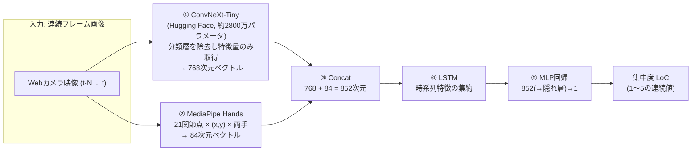
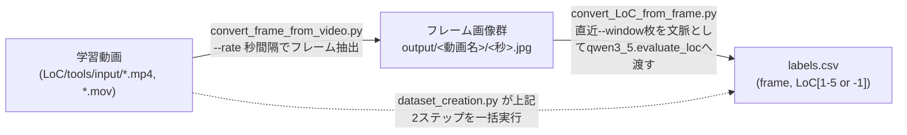

# Online Study Room

オンライン自習室サービスのための研究開発リポジトリ。現時点での中核コンポーネントは、**Webカメラ映像から学習者の集中度（LoC: Level of Concentration）を1〜5の5段階で推定するマルチモーダル回帰モデル**（`LoC/` ディレクトリ）です。

> **リポジトリの現状について**
> このリポジトリは実装が進行中のプロトタイプです。`LoC/` 配下の各モジュール（ConvNeXt / MediaPipe Hands / LSTM / MLP）は現状 **それぞれ独立した検証用スクリプト（PoC）** であり、最終的なパイプラインとして結線されていません。詳細は [現在の実装状況と既知のギャップ](#現在の実装状況と既知のギャップ) を参照してください。

## 目次

- [プロジェクト概要](#プロジェクト概要)
- [リポジトリ構成](#リポジトリ構成)
- [LoC集中度推定モデル：アーキテクチャ](#loc集中度推定モデルアーキテクチャ)
- [データ作成パイプライン](#データ作成パイプライン)
- [セットアップ](#セットアップ)
- [使い方](#使い方)
- [テスト](#テスト)
- [現在の実装状況と既知のギャップ](#現在の実装状況と既知のギャップ)
- [技術選定メモ](#技術選定メモ)

## プロジェクト概要

Online Study Room は、オンライン自習室（作業用ライブ配信/共同学習ルーム）上で、参加者の学習映像から**集中度を自動でスコアリングする**ことを目指すプロジェクトです。

- リポジトリ直下の `main.py` と `System/` は、将来的にアプリケーション本体（自習室サービス側）を実装するためのプレースホルダーで、現時点では未実装（空）です。
- 実質的な開発は `LoC/`（Level of Concentration の略）ディレクトリに集約されており、次の2本柱で構成されています。
  1. **モデルアーキテクチャの実装**（ConvNeXt-Tiny + MediaPipe Hands + LSTM + MLP による集中度回帰モデル）
  2. **学習データ作成パイプライン**（学習動画 → フレーム分割 → VLM（Ollama / qwen3.5）による集中度の自動ラベリング）

## リポジトリ構成

```
Online_Study_Room/
├── main.py                        # (未実装/空) アプリケーション エントリーポイント
├── System/                        # (未実装/空) 自習室サービス本体を実装予定のディレクトリ
├── .gitignore
└── LoC/                            # 集中度(LoC)推定モデルの開発一式
    ├── core.py                     # モデル統合のエントリポイント（現状は import のみ、未結線）
    ├── ConvNeXt.model.py           # ConvNeXt-Tiny ロードの最小サンプル
    ├── MediaPipe_Hands.sample.py   # MediaPipe Hands によるWebカメラ手検出デモ
    ├── README.md                   # (簡易版) フレーム抽出スクリプトの使い方メモ
    ├── requirements.txt            # 依存パッケージ（現状 opencv-python のみ）
    │
    ├── ConvNeXT/                   # 画像特徴抽出（意味ベクトル）
    │   ├── tiny_model.py           # ConvNeXt-Tiny で画像から生ロジットを取得するCLI
    │   ├── finetune.py             # HuggingFace Trainer によるファインチューニング雛形
    │   └── output/logits.npy       # tiny_model.py 実行結果のサンプル出力
    │
    ├── MediaPipe_Hands/            # 手指運動特徴抽出
    │   └── hand_feature_extractor.py # HandFeatureExtractor / extract_hand_features（84次元特徴ベクトル抽出）
    │
    ├── LSTM/                       # 時系列特徴抽出
    │   ├── LSTM.py                 # SimpleLSTM（サイン波予測によるPoC）
    │   └── LSTM_train.py           # 上記の学習ループサンプル
    │
    ├── MLP/                        # 回帰/分類ヘッド
    │   ├── MLP_classifier.py       # 2層MLP（PoC、現状は2値分類設定）
    │   └── MLP_classifier_train.py # 上記の学習ループサンプル
    │
    ├── tools/                      # データ作成パイプライン
    │   ├── convert_frame_from_video.py  # 動画 → 秒間隔でのフレーム画像切り出し
    │   ├── convert_LoC_from_frame.py    # フレーム群 → LoCラベルCSV生成（Ollama/qwen3.5使用）
    │   ├── dataset_creation.py          # 上記2つを1コマンドで実行する統合パイプライン
    │   ├── qwen3_5.py                    # Ollama経由でqwen3.5にLoCを判定させるプロンプト＋呼び出し
    │   ├── input/                        # (gitignore) 元動画の置き場
    │   └── output/                       # (gitignore) 抽出フレーム & labels.csv の出力先
    │
    └── tests/
        ├── test_dataset_creation.py       # dataset_creation のユニットテスト
        └── test_hand_feature_extractor.py # HandFeatureExtractor のユニットテスト
```

## LoC集中度推定モデル：アーキテクチャ

設計上のゴールは、直近の連続フレーム（Webカメラ映像）から、現在の集中度を **1〜5の回帰値** として出力するモデルです。画像の「意味情報（何をしているか）」と「手の運動情報（ペンを動かしている/スマホを触っているなど）」を別々に抽出し、時系列方向にLSTMで統合したうえでMLPにより回帰します。



| # | コンポーネント | 役割 | 次元 | 対応する実装 | 状態 |
|---|---|---|---|---|---|
| ① | ConvNeXt-Tiny | 画像の意味ベクトルを抽出（分類ヘッドを外し特徴抽出器として使用、ファインチューニング想定） | 768 | `LoC/ConvNeXT/tiny_model.py`, `LoC/ConvNeXT/finetune.py`, `LoC/ConvNeXt.model.py` | 画像分類（1000クラス/ロジット取得）のPoCのみ。特徴抽出用ヘッドレス化・ファインチューニングは未実装 |
| ② | MediaPipe Hands | 手指21関節点から運動特徴を抽出 | 84 (21×2×2) | `LoC/MediaPipe_Hands/hand_feature_extractor.py`（`HandFeatureExtractor` / `extract_hand_features`）, `LoC/MediaPipe_Hands.sample.py`（Webカメラ可視化デモ） | 実装済み。画像(BGR)を渡すとLeft/Right各42次元・計84次元のベクトルを返す。未検出の手は0埋め |
| ③ | Concat | ①②を結合 | 852 | 未実装 | — |
| ④ | LSTM | 時系列特徴の集約 | 852→hidden | `LoC/LSTM/LSTM.py`, `LSTM_train.py` | サイン波予測によるPoCのみ（`input_size=1`）。852次元入力への対応は未実装 |
| ⑤ | MLP回帰 | 集中度(1〜5)への変換 | hidden→1 | `LoC/MLP/MLP_classifier.py`, `MLP_classifier_train.py` | 2値分類のPoCのみ（`num_classes=2`, `CrossEntropyLoss`）。1〜5への回帰化は未実装 |

`LoC/core.py` はこれらのモジュールを統合するエントリポイントとして用意されていますが、`MediaPipe_Hands`（`HandFeatureExtractor`, `HAND_FEATURE_DIM`）の import 以外は未結線で、ConvNeXt・LSTM・MLPを繋ぐforward処理はまだ実装されていません。

## データ作成パイプライン

上記モデルを学習するための教師データを作るパイプラインが `LoC/tools/` にあります。人手でのラベリングの代わりに、ローカルで動くVLM（Ollama経由のqwen3.5）に判定させる方式です。



- **`convert_frame_from_video.py`**: 動画（または動画の入ったディレクトリ）を受け取り、`--rate` 秒ごとに1フレームを `output/<動画ファイル名>/<秒数>.jpg` として書き出します（OpenCV使用）。
- **`qwen3_5.py`**: Ollama の `qwen3.5:9b`（既定）にシステムプロンプト＋複数枚の連続画像を渡し、判定ステップ（完全な集中切れ→学習外行動→学習中のレベル分け、の3段階ルール）に従って `{"reason": ..., "level": 1-5}` のJSONを返させます。出力からlevelを頑健にパースする `evaluate_loc()` を提供します。
- **`convert_LoC_from_frame.py`**: フレームディレクトリ内の画像をソートし、各フレームについて直近 `--window`（既定20、内部上限もDEFAULT_WINDOW=20）枚を文脈としてqwen3.5に渡し、`labels.csv`（`frame`, `LoC`）を出力します。`--simulate` で実際のOllama呼び出しなしに固定値（LoC=3）を書き出すテストモードもあります。
- **`dataset_creation.py`**: 上記2つを1コマンドに統合したパイプライン。動画（複数可）ごとに「フレーム抽出 → LoCラベリング」を実行し、`output/<動画名>/` 以下にフレーム画像と `labels.csv` を生成します。

## セットアップ

```bash
# Python 仮想環境の作成（例）
cd LoC
python -m venv .venv
.venv\Scripts\activate   # PowerShell / Windows

pip install -r requirements.txt
```

> **注意**: `LoC/requirements.txt` には `opencv-python`, `mediapipe`, `numpy` が記載されています。以下の機能を使う場合は別途インストールが必要です（未整備・要更新）。
>
> | 用途 | 追加で必要なパッケージ |
> |---|---|
> | ConvNeXt (`ConvNeXT/`, `ConvNeXt.model.py`) | `torch`, `torchvision`, `transformers`, `datasets`, `evaluate`, `pandas`, `scikit-learn`, `matplotlib`, `seaborn` |
> | MediaPipe Hands (`MediaPipe_Hands/`, `MediaPipe_Hands.sample.py`) | `mediapipe`, `opencv-python`, `numpy`（`requirements.txt` に記載済み） |
> | LSTM / MLP (`LSTM/`, `MLP/`) | `torch`, `numpy` |
> | 集中度ラベリング (`tools/qwen3_5.py`) | `ollama`（Pythonパッケージ）＋ ローカルで [Ollama](https://ollama.com/) を起動し `qwen3.5` モデルをpull済みであること |
> | テスト | `pytest` |

## 使い方

### 動画からフレームを抽出する

```bash
python LoC/tools/convert_frame_from_video.py <動画ファイル or ディレクトリ> --output output --rate 1
```

- `--rate`: サンプリング間隔（秒）。既定 `1`。
- 出力は `output/<動画ファイル名>/<秒数>.jpg`。

### フレーム群から集中度ラベル(labels.csv)を生成する

```bash
# Ollama + qwen3.5 が必要
python LoC/tools/convert_LoC_from_frame.py output/<動画ファイル名> --window 20

# Ollamaなしで動作確認だけしたい場合
python LoC/tools/convert_LoC_from_frame.py output/<動画ファイル名> --simulate
```

### 動画 → フレーム抽出 → ラベリングを一括実行

```bash
python LoC/tools/dataset_creation.py <動画ファイル or ディレクトリ> --output output --rate 5 --window 20
```

### ConvNeXt-Tiny で画像の生ロジットを取得する

```bash
python LoC/ConvNeXT/tiny_model.py <画像パス> --output LoC/ConvNeXT/output/logits.npy
```

### MediaPipe Hands のWebカメラデモ

```bash
python LoC/MediaPipe_Hands.sample.py
# `q` / `Esc` で終了
```

### MediaPipe Hands で画像から84次元特徴ベクトルを取得する

```bash
python LoC/MediaPipe_Hands/hand_feature_extractor.py <画像パス> --output features.npy
```

コードから使う場合:

```python
from MediaPipe_Hands.hand_feature_extractor import HandFeatureExtractor

with HandFeatureExtractor() as extractor:
    features = extractor.extract(frame_bgr)  # shape: (84,)
```

## テスト

```bash
cd LoC
pytest
```

現状のテストは `tests/test_dataset_creation.py`（`dataset_creation.build_pipeline_config` の設定値組み立てを検証）と `tests/test_hand_feature_extractor.py`（`HandFeatureExtractor` の出力次元・0埋め挙動を検証）です。

## 現在の実装状況と既知のギャップ

READMEの精度維持のため、調査時点（2026-07-18）で確認できた未実装・不整合点を明記します。

- **`main.py` / `System/`**: 空。自習室サービス本体は未着手。
- **`LoC/core.py`**: `LSTM`, `MLP_classifier`, `MediaPipe_Hands.HandFeatureExtractor` を import しているのみで、ConvNeXtとの結線やforward処理は未実装。
- **ConvNeXt側**: `tiny_model.py` は画像分類ロジット（1000クラス）を返すデモであり、アーキテクチャ設計にある「分類層を外して768次元特徴量のみ取得」する実装はまだない。`finetune.py` は（LoCとは別の）料理画像256クラス分類のファインチューニング雛形が流用されている状態。
- **MediaPipe Hands側**: `MediaPipe_Hands/hand_feature_extractor.py` で21点×(x,y)×両手＝84次元の特徴ベクトルを返す `HandFeatureExtractor` / `extract_hand_features` を実装済み（`MediaPipe_Hands.sample.py` は引き続きOpenCVウィンドウでの可視化デモとして独立に存在）。
- **LSTM / MLP側**: いずれもサイン波・ダミーデータによる単体PoC。`LSTM.py` の `input_size=1`、`MLP_classifier.py` の `input_size=10, num_classes=2` は、最終アーキテクチャの852次元入力・1〜5回帰出力とは一致していない。`MLP_classifier` は名称・実装（`CrossEntropyLoss` による分類）ともに回帰用ではない。
- **`requirements.txt`**: `opencv-python` / `mediapipe` / `numpy` は記載済みだが、`torch` / `transformers` / `ollama` 等は未記載。
- **`LoC/README.md`**: `tools/convert_image_from_video.py` を参照しているが、実ファイル名は `tools/convert_frame_from_video.py`（初回コミット後にリネームされ、READMEが未更新）。
- **学習用動画・生成物**: `LoC/tools/input/`, `LoC/tools/output/`, `LoC/.venv/`, `LoC/tools/venv/` は `.gitignore` により追跡対象外（大容量の動画・大量のフレーム画像・仮想環境のため）。

## 技術選定メモ

開発中に検討・採用した技術の整理です。

- **時系列モデル**: RNN → LSTM → Transformer の順で検討し、現状は **LSTM** を採用（`LoC/LSTM/`）。Transformerへの置き換えは将来候補として保留中。
- **集中度回帰モデル本体**: 上記「[LoC集中度推定モデル：アーキテクチャ](#loc集中度推定モデルアーキテクチャ)」を参照。ConvNeXt-Tiny（画像特徴, 768次元）とMediaPipe Hands（手の運動特徴, 84次元）をconcatし、LSTMで時系列統合したうえでMLPにより1〜5のLoCへ回帰する設計。
